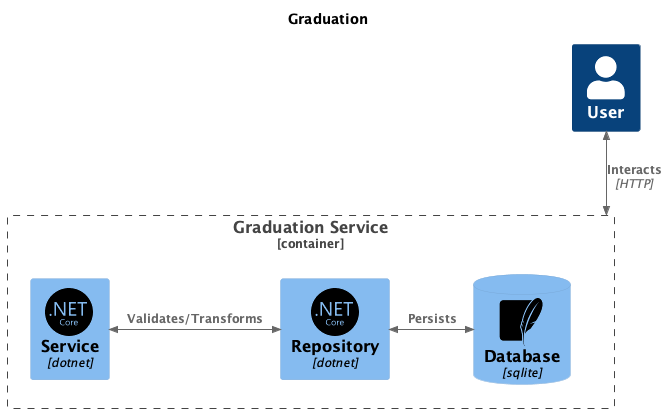
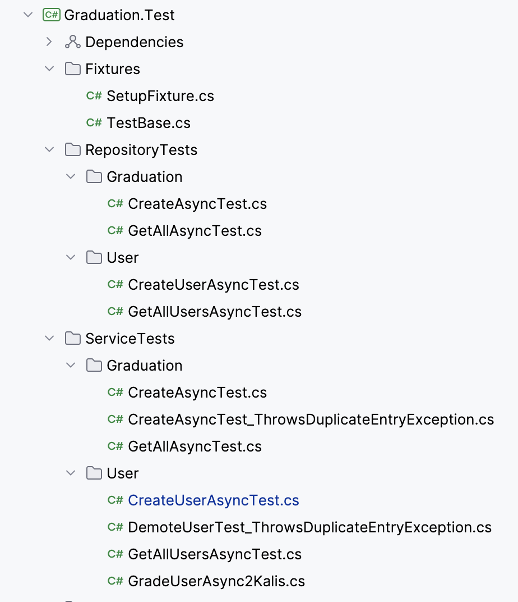
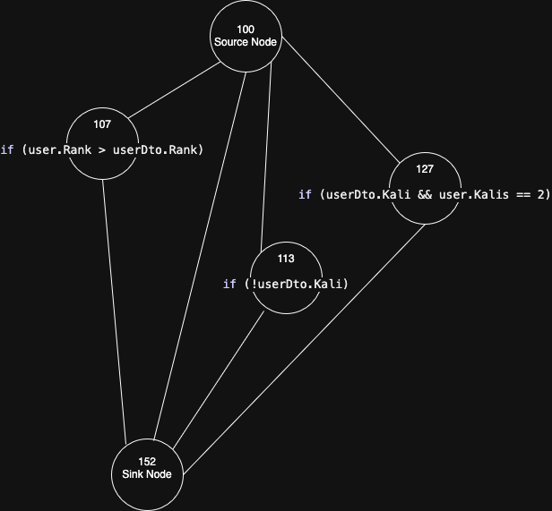

# Synopsis

## Description

A minimal solution for grading practitioners (a karate ka, from here on) of Shotokan Karate
The project aims to demonstrate some key elements of testing software

- Unit Testing
  - Discussions on where a mock could have been beneficial
- Functional testing
  - A test suite in Post
- Path testing
  - Program Paths
  - Cyclomatic Complexity

## Terminology
- Grade
  - The scale goes goes from 10th Kyu down towards 1st Kyu from there it goes from 1st Dan to 10th Dan. In this application 10th Kyu holds the value of 0, and 10th Dan holds the value of 20
- Kali
  - A remark on a gradution. Can't be given to 1st Dan and above. They simply fail their graduation

## Business rules

- Graduations
  - There can only be one graduation for a given date

- Karate kas
  - A karate ka can not get a lower grade than she already has

- Kalis
  - Kalis accumulate up until the 3rd consectutive, where it is removed, and the previous grade is given
  - If a grading does not include a kali, previous kalis are removed


## Helicopter view description of application

The application is a .NET MVC application with a repository that deals with database interaction. SQLite was chosen for the database, for the sake of testability. More on that later
Any logic/sanitation that is not enforced be database integrity, is done in the service layer
Finaly a controller layer communcates with the service layer. All methods a async



  
## Tests

### Unit Tests

Nunit is running the Unit tests, and an attempt has been made to follow its naming conventions. Somewhat succeding
Unit tests are organised in its own project, that references the Graduation project
The test project aims to reflect the application structure, meaning that Repository and Service has their own folder, where tests once again is organized in Users and Gradutation


{width=100% .left}


\newpage


With hindsight the choise of database could have been better. It solves what it is supposed to do in the application, but when it comes to tests a rather complex setup had to be introduced, going towards the level of complexity that in it self would need testing.
A Mocked solution could have removed a quite substansial part of the setup, maybe not resulting in reduced codes (when counting lines), but it would be simpler to look at

When testing methods with side effects in the service layer (everything but CreateUserAsync and GetAllUsersAsync), the tests rely on data allready existing in the database. To ensure that tests are deterministic, the test project has a static class called TestData, that can be used in all setups of test. Ficed Dates and Id's has been split out in its own static class, so that it can be referenced both when seeding data, but also when asserting the returned data
Ex.


```csharp
using Graduation.Core;

namespace Graduation.Test.TestData;

public static class SharedValues
{
    public static readonly int demotedUserId = 2000;
    public static readonly Ranks demotedUserRank = Ranks.Dan2;
    public static readonly Ranks demotedUserRankAfterPromotion = Ranks.Dan1;

    public static readonly int userWith2Kalis = 2001;
    public static readonly int userWith0Kalis = 2002;

    public static readonly Ranks userWith2KalisRank = Ranks.Dan1;
}
```


### Functional tests

To test the application from the outside, there is a Postman test collection setup.
Just as the unit tests, the functional tests are split up, but just in Graduation and Users. When testing methods with side effects, Postmans pre-requests features are used, to seed the application with data.

## Path testing

There is only a few methods with complexity in them, as an example of Path Testing, the business rules for Kalis is descriped here



Cyclomatic complexity:
- C = R + 1
  - Number of enclosed regions, plus 1 (the imaginary edge between source and sink)
  - Result = 4
- C = E - N + 2
  - Number of edges minus number of nodes + 2
  - Result = 4

A rule of thumb states that Cyclomatic Complexity should now be > 10, otherwise the code should be refactored. We are safe for now

### Test cases

Line 127 has 2 atomic statements, and therefore needs a multiple condition coverage approach, to ensure that everything is tested

```csharp
if (userDto.Kali && user.Kalis == 2)
```

| Testcase | a | b | a ^  b |
| -- | -- | -- | -- |
| 1 |  true | true | true |
| 2 | true | false | false |
| 3 | false | true | false |
| 4 | false | false | false |

Testcases 3 and 4 does not change the decision, if the second statement changes, and therefore one of them is redundant. We can reduce the needed testcases to the following

| Testcase | a | b | a ^  b |
| -- | -- | -- | -- |
| 1 |  true | true | true |
| 2 | true | false | false |
| 3 | false | true | false |